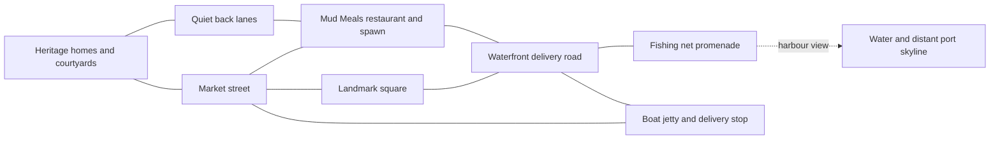

# Kochi waterfront rebuild plan

Status: the user approved the reference direction and explicitly authorized implementation and heat optimization on 2026-10-04. The Fort Kochi waterfront gameplay slice is implemented; the citywide district proposals below remain future scope.

## Generated review references

Created on 2026-10-04 after the user authorized preparation of the review images:

- [District layout concept](art/kochi-waterfront-layout-concept.png): schematic district overview and detailed restaurant/market/waterfront loop. Coordinates, landmark placement and route markings are illustrative pending geographic verification.
- [Gameplay visual concept](art/kochi-waterfront-gameplay-concept.png): restaurant corner, rider, shops, promenade, fishing nets and harbour, using the supplied palette and architectural references.

Both are generated design references, not actual game captures or validated mobile rendering. Asset fidelity, camera framing and performance must be demonstrated in the implemented first slice. The references guided implementation. Actual runtime captures are produced by `npm run check:maps:browser` under `artifacts/real-map/`; generated images are not evidence of runtime fidelity.

## Visual target and reason for rebuilding

Use the user's supplied waterfront image (`72849.jpg`) as the composition target and their original Mud Meals game image as the palette target. The scene should read as Kochi: tiled heritage buildings, deep verandas, coconut palms, busy small streets, a stone waterfront, fishing nets and boats. Natural proportions, varied silhouettes, believable materials and contact shadows matter more than adding object counts.

The previous playable snapshot covered central Ernakulam (96 roads, 606 building footprints). Its imported areas contained two small water polygons and two woodland polygons. It lacked the broad shore and landmark arrangement needed for the supplied reference. Its uniform grass base, repeated wall/roof treatment and low driving camera weakened the intended composition.

## Additional city references

The five supplied images (`72861.jpg` through `72857.jpg`) extend the visual direction beyond one waterfront street. They establish three distinct environments: heritage Kochi, modern Ernakulam, and the harbour/islands connecting their views. Treat these labelled aerial compositions as illustrative visual references, not verified photographs or survey maps. Several geographic relationships need correction before use: Fort Kochi and Mattancherry share a peninsula; Broadway Market is in Ernakulam; bridge connections, metro alignments and the mall location require independent verification.

| District proposal | Visual character | Suggested delivery destinations |
| --- | --- | --- |
| Fort Kochi and Mattancherry | Low-rise tiled buildings, shaded heritage streets, waterfront market activity, fishing nets and verified landmark silhouettes | Mud Meals restaurant, residential gate, local shop and jetty service bay |
| Ernakulam and Marine Drive | Mixed-height buildings, busy commercial roads, promenade, station frontage and a verified elevated metro corridor | Office frontage, shopping street and station forecourt |
| Harbour and islands | Broad water, ferries, bridge views, port cranes, boats and green island silhouettes | Publicly accessible jetty or waterfront service area; restricted port areas remain background scenery |

This is a proposed citywide art direction, not approval to implement all districts. Keep the first completed gameplay slice at Fort Kochi's restaurant/waterfront. Subsequent districts would be reviewed and built in stages. Determine continuous road connections versus separate loaded areas from geographic scale and measured mobile performance; do not invent bridges or instant road crossings through the harbour. Ferry travel is a later gameplay decision, not part of the first release.

The next reference package should show the overall district arrangement plus one close gameplay view. A top-down diagram must distinguish proposed playable streets, scenic background and later districts. Retain the original warm Mud Meals palette across districts while allowing taller buildings and cooler harbour water to give Ernakulam a different silhouette.

The additional three references (`72855.jpg`, `72854.jpg`, `72851.jpg`) refine the following details:

- **Market and station street:** continuous occupied frontages, colourful awnings, visible crossing markings, planted junction islands, service bays and mixed building heights. Verify station, market and bridge relationships instead of reproducing the labelled composition literally. Elevated roads need actual ramps, sufficient clearance and separate collision surfaces if included.
- **Modern waterfront:** a varied skyline behind low-rise shops, shaded promenade, jetties, deeper harbour water, distant cranes and a verified metro corridor. Keep large transport structures geographically grounded and prevent them from hiding the bike route at the normal camera angle.
- **Thekkady-labelled town image:** useful reference for layered vegetation, restaurants, bus bays, fuel-station forecourt and clear visual organisation. It is outside the Kochi plan. It does not authorize restoring Thekkady or placing Periyar Lake, forest-reserve labels, elephants or mountain scenery in Kochi. Reuse only locally appropriate town-detail ideas.

Additional visual acceptance: streets should feel occupied through purposeful frontages, planting and service areas, rather than increasing randomly scattered props. Roads and water should divide recognisable districts; a skyline, transit corridor or landmark helps orientation. Capture those qualities from the playable bike camera as well as from above.

## Proposed geographic foundation

Rebuild Kochi around a compact Fort Kochi waterfront area. Select the exact OSM bounds after checking the shore, streets, access restrictions and landmark footprints. A preliminary scope is roughly 800 by 650 metres of playable land, with the harbour beyond it; size may change to fit the real street network.

- Retain actual shore and street relationships where mapped. Join and clip the directed coastline with land holes in the harbour surface. Generic relation-based multipolygon support is outside this compact snapshot.
- Use the reference as art direction, not a surveyed map. Do not relocate actual monuments merely to reproduce its composition.
- Place the fictional Mud Meals restaurant in a suitable authored frontage. Keep actual landmarks geographically grounded; label gameplay-only additions as illustrative in the map documentation.
- Canals, bridges, farmland and harbour infrastructure enter the playable area only if supported by the selected geography. Otherwise use the reference's planting and depth without inventing those features as real locations.
- This is a rebuild of Kochi. Munnar and Thekkady remain removed.

## Spatial plan

This diagram describes desired connections, not surveyed positions. Align it with the selected streets before approving the final top-down layout.

| Area | Composition and purpose |
| --- | --- |
| Restaurant corner | Main visual anchor: original two-storey tiled building, veranda, warm sign, takeaway counter, parked bikes and delivery bay. Spawn faces a view with street activity and water. |
| Waterfront | Continuous stone edge, shaded promenade, railings, lamps, benches and occasional planted pockets. Shore curve creates depth and opens views between buildings. |
| Market street | Closely spaced but varied shopfronts, tea and fruit stalls, cloth awnings, readable local signs and service spaces. Trees interrupt repetition without covering entrances. |
| Landmark square | Heritage church or other verified local landmark, broad silhouette, paved square and restrained surrounding props. Check actual location before selecting it. |
| Fishing nets and jetty | Recognisable timber net structures, ropes, raised platforms and working boats. A ferry or houseboat adds distant movement; no boat gameplay in the first release. |
| Residential lanes | Smaller homes, low walls, gates, planted courtyards, utility poles and visible entrances. Open ground receives a deliberate use: paving, garden, service yard or shore. |
| Back lanes | Narrow connected shortcuts and a short unpaved service route where the approved layout permits. Clear dead ends and safe turn-around space. |

Provisional gameplay dimensions: main streets 6–8 metres wide, lanes 3–4 metres, pedestrian strips 1.5–2.5 metres. Preserve real-data widths in geographic mode; any widening for gameplay must be recorded as an illustrative adjustment. Promenade access follows actual restrictions; pedestrian-only stretches are scenery rather than bike shortcuts.

## Routes and gameplay

Reuse driving, rider rigs, motorcycle selection, touch controls, traffic and delivery state. The bike remains freely steerable over traversable ground; navigation lines guide rather than constrain it.

Plan three connected delivery choices: the clear waterfront route, a busy market route and a quieter residential route. Initial named stops: restaurant pickup, market customer, residential gate and jetty service bay. Place stops outside traffic lanes, water, shop interiors and pedestrian-only spaces. Existing delivery selection must be adapted to reachable named stops; arbitrary segment midpoints are not sufficient.

Traffic uses roads wide enough for its vehicles. Vendors remain at stalls; walking routes follow clear pedestrian spaces. Keep road intersections visible and prevent activity from closing the bike's passage. Map and minimap use the same approved geometry, with water and destinations clearly distinguished.

## Art, camera and mobile

Retain warm cream plaster, varied terracotta roofs, natural tropical greens, turquoise shallows, deeper blue harbour water and restrained warm sunlight. Avoid a global colour-grade change. Match materials under the same light before dressing the whole map.

Start with a small reusable set of original models: restaurant, two shopfronts, two homes, a landmark facade, fishing net, jetty, boat, coconut palm and broadleaf tree. Roof massing, shutter depth, eaves, verandas, trunks and leaf silhouettes must read well from the gameplay camera. Primitive placeholder assets are acceptable for layout only. Photos inform construction; copyrighted photographs and brand designs are not runtime assets without permission.

Use a raised three-quarter gameplay camera that shows the next junction, bike, building fronts and waterfront together. Tune it in portrait and landscape instead of accepting only an attractive aerial screenshot. Preserve visible rider steering and brake/accelerate controls; reduce HUD coverage of the route and restaurant view.

Reuse Three.js rendering, instancing and the existing quality switch. Group scenery into spatial batches for culling; share materials/textures and simplify distant nets, foliage and boats. Keep animation local to the player. Use restrained water animation rather than expensive full-scene reflection rendering on phones.

Proposed performance acceptance: sustained 30 FPS on a representative mid-range phone in low-detail mode during a two-minute busy route, plus responsive simultaneous acceleration and steering. Measure frame times, draw calls, triangles and memory before setting final budgets. Desktop/browser correctness checks alone cannot certify phone performance.

## Build order

1. **Layout and visual reference — before implementation.** Produce a top-down layout aligned with the chosen geographic source and a matching gameplay-view reference. Show road connections, water, landmark positions, restaurant, delivery stops and traversable service paths. The user approves this pair before playable-map changes.
2. **Connected blockout.** Implement land/water and the road loop with placeholder building masses, collision, spawn and named stops. Check connectivity, full-bike clearances, waterfront barriers and camera visibility. Keep the current Kochi snapshot until its replacement works.
3. **Restaurant waterfront slice.** Finish roughly 150 by 150 metres around the restaurant, shoreline, adjacent market and one landmark view. Present actual gameplay screenshots in landscape and portrait. Inspect the actual gameplay view before extending the same assets across the map.
4. **District completion.** Extend the approved art to residential lanes, landmark square, fishing nets and jetty. Add purposeful yards, plants and streetside detail; inspect views along complete playable routes for repetition and empty grass patches.
5. **Population and polish.** Add restrained crowds, vendors, road traffic and background boats. Tune shadows, foliage, water, signs, camera and HUD using the approved palette.
6. **Validation and delivery.** Build; run geographic/geometry checks and browser driving/delivery tests; exercise every named route and dead end; test portrait/landscape touch input and real-phone performance. Present final actual screenshots and clearly distinguish local changes from GitHub push or publication.

## Acceptance criteria

- The starting gameplay view clearly shows Kerala architecture, an active restaurant frontage and the waterfront relationship.
- The approved shoreline, street graph and landmarks match the selected geographic foundation; illustrative adjustments are disclosed.
- Building height, roof shape, frontage and material variations prevent repeated block-like streets. Empty ground has a clear purpose.
- Fishing nets and jetty remain recognisable at the normal camera distance. Vegetation is believable and does not hide delivery stops or junctions.
- All named delivery stops are reachable, clear of traffic and protected from water. Collision agrees with visible solid structures and barriers, including on bridges if present.
- Portrait and landscape layouts keep the road ahead readable while supporting two simultaneous touch controls.
- Build and meaningful browser checks pass; phone performance is measured separately.

## Implementation scope after approval

Update the existing Kochi snapshot/importer, map geometry and scenery, camera/minimap and delivery-stop selection. Reuse shared renderer, controls, characters and vehicle systems. Keep the plan in this document; add only the minimal map/asset data needed for approved content rather than creating a second game engine or adding unrelated systems.

The local implementation is ready for review. GitHub push and publication are separate actions.

## Implemented slice and verification

- Actual OSM Fort Kochi streets and shore: 106 road features, 902 building footprints, coastline land holes and mapped landmark anchors. No invented bridge or playable metro corridor.
- Original restaurant, four occupied waterfront stalls, stone quay/rails, palms, benches, lamps, four fishing nets, a timber jetty and four boats. The mapped St Francis Church footprint has an authored facade. Existing urban infill gives open plots homes, tea stalls or gardens.
- Three named deliveries on connected real roads, freely steerable bike controls, original motorcycle models and rigged people. Coastline water, solid structures and quay rails participate in collision. The dirt service passage and bays are tested using the full bike footprint.
- Raised follow camera, compact portrait/landscape HUD, minimap coast holes and road-based delivery guidance. Actual default-camera captures are `kochi-waterfront-gameplay.png` and `kochi-mobile.png`; other browser captures use inspection cameras.
- A shared 30 FPS default/60 FPS option, hidden-tab suspension, paused redraws, GPU backpressure, spatial batches and actor culling reduce rendering load. Visible asset detail, AO settings and shadow resolution are retained. See [measured results](rendering-performance.md).

Automated geographic, geometry, driving, frame-loop and Chromium checks cover this implementation. Sustained physical-phone frame times and temperature remain unmeasured in the cloud environment. The generated references remain an art-direction target; the implemented scene uses procedural game assets rather than photographic scans.
